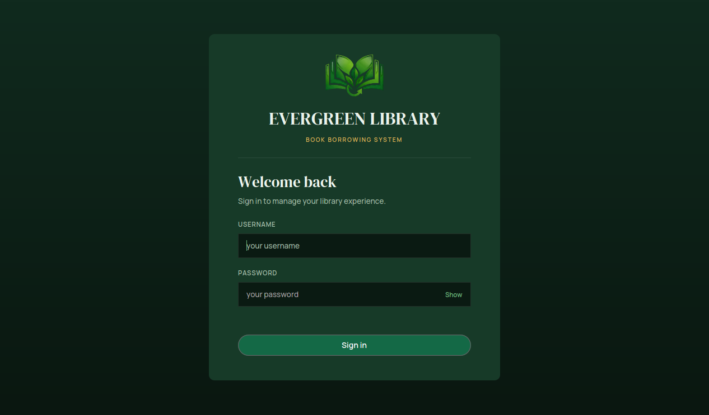
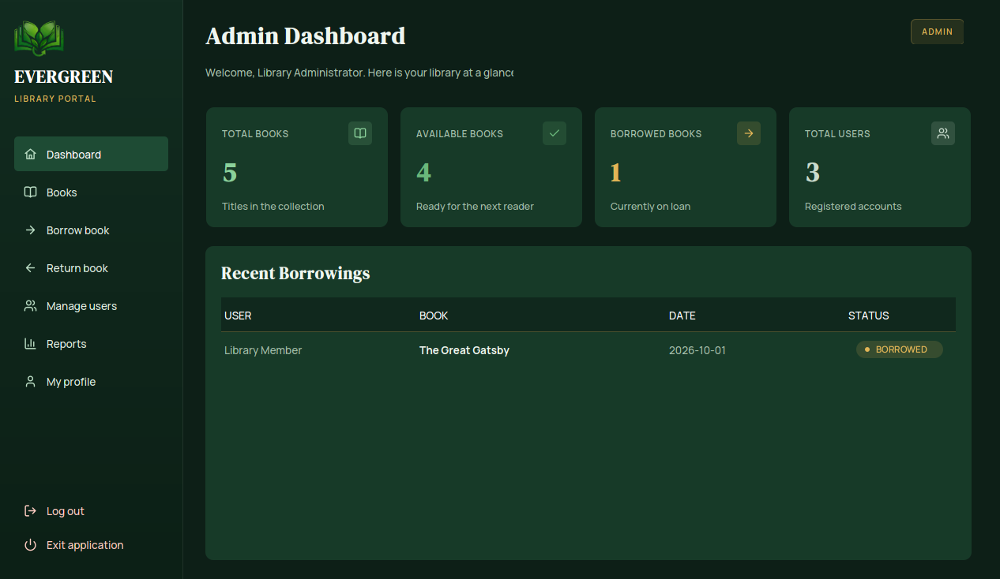
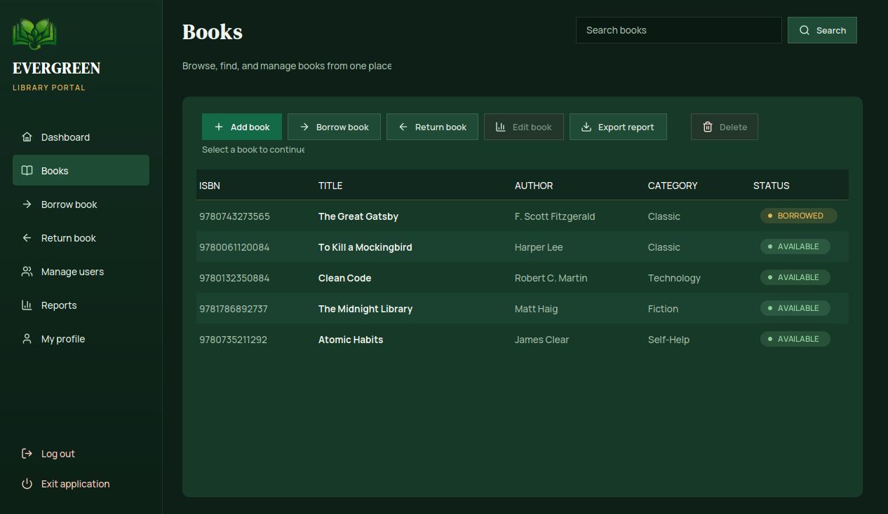

# Evergreen Library - Book Borrowing System

A desktop library management system built with **Java Swing** and a local **SQLite** database.
It covers the full borrowing cycle - catalogue, members, loans and returns - behind a role-based
sign-in, with every database call going through JDBC `PreparedStatement`s.



## Features

| Area | What it does |
|---|---|
| **Sign in** | Three roles - Admin, Staff and Member - each with its own dashboard |
| **Books** | Add, edit and delete titles, with confirmation before a delete |
| **Borrow / Return** | Records the borrower, borrow date, a 14-day due date and the return date, in a transaction |
| **Search** | Filters the catalogue by title, author, ISBN or category |
| **Users** | Add, edit and disable accounts (Admin only) |
| **Reports** | Filterable loan history with CSV export (Admin and Staff) |
| **Profile** | View account details and change your own password |

## Screenshots

| Admin dashboard | Books |
|---|---|
|  |  |

## Tech stack

| | |
|---|---|
| Language | Java 17 |
| Interface | Swing + [FlatLaf 3.6.2](https://github.com/JFormDesigner/FlatLaf) |
| Database | SQLite via `sqlite-jdbc 3.53.4.0` |
| Data access | JDBC `PreparedStatement` + transactions |
| Build | Apache Ant (`build.xml`) |

## Getting started

**Requirements:** JDK 17 or newer. Nothing else to install - both libraries are included in `lib/`.

**In NetBeans:** open the project folder and press **F6**.

**From a command line:**

```powershell
ant clean jar
java --enable-native-access=ALL-UNNAMED -cp "dist\LibraryBookBorrowingSystem.jar;lib\flatlaf-3.6.2.jar;lib\sqlite-jdbc-3.53.4.0.jar" library.Main
```

The database is created and seeded automatically on first launch, so there is nothing to configure.

## Default accounts

| Username | Password | Role |
|---|---|---|
| `admin` | `admin123` | Full access: books, users, reports, profile |
| `staff` | `staff123` | Books and reports, no user management |
| `member` | `member123` | Browse, borrow and return, own loan history |

## Project structure

```
src/library/
├── Main.java          entry point
├── auth/              sign-in, session and roles
├── model/             Book, Borrowing, User
├── dao/               every SQL statement, all parameterised
├── service/           validation and business rules
├── database/          connection, schema creation, seed data
├── ui/                Swing screens, theme and icons
└── util/              fonts, colours, logo, password hashing
```

The layering is deliberate: screens never touch JDBC directly. A screen calls a **service** (which
validates input and applies the business rules), the service calls a **DAO** (which owns the SQL),
and the DAO returns **model** objects.

## Notes

- Data lives in `data/library.db`. Delete that file to start again from a fresh, seeded database.
- The database path is relative, so launch the app from the project folder.
- Passwords are stored hashed, never in plain text.
